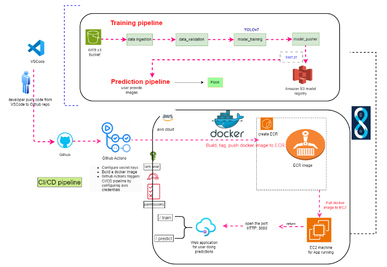
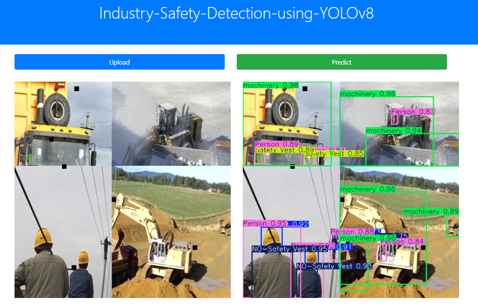
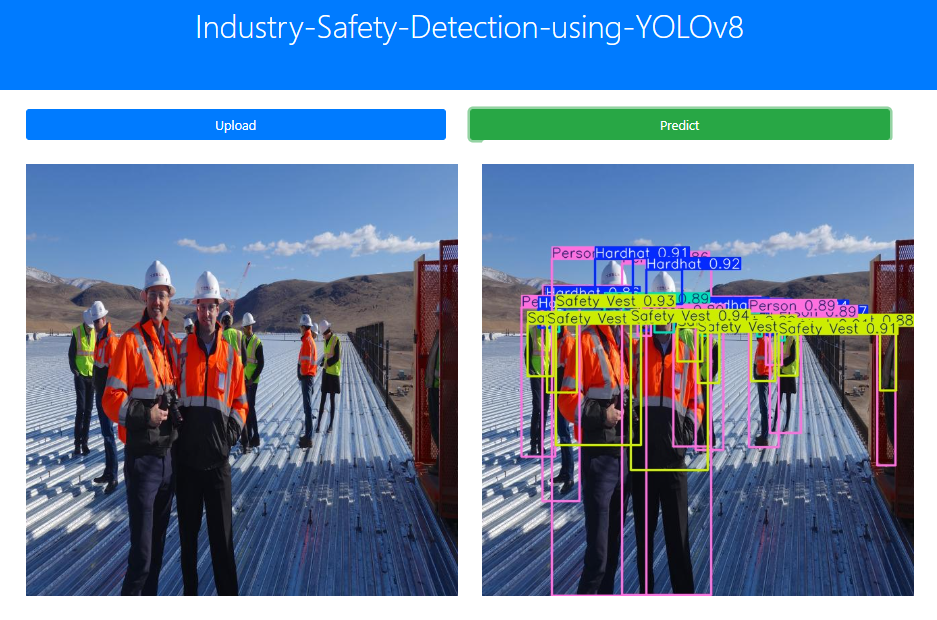

# Industry Safety Detection Using YOLOv8

# Introduction

This project aims to enhance worker safety in industrial environments by developing an **end-to-end MLOps pipeline** for Industry Safety Detection using the **YOLOv8** model. The model is trained to detect 10 different classes, including critical safety-related objects such as 'Hardhat', 'Mask', and 'Safety Vest'. By leveraging real-time object detection, this system provides an automated solution for identifying safety breaches on industrial sites, reducing the risk of workplace accidents.

The pipeline is designed to streamline the entire **machine learning workflow**, consisting of key stages like **data ingestion**, **data validation**, **model training**, and **model evaluation**. Data is automatically ingested and validated to ensure its quality before training the YOLOv8 model. The model evaluation is managed using MLflow, which tracks important metrics such as **mean average precision (mAP)** and facilitates comparison between model versions.

To ensure seamless deployment and scalability, the project incorporates a **CI/CD pipeline** using **Docker** images. These Docker containers encapsulate the entire model environment, making it easy to deploy the trained models on **AWS**. Specifically, we use **AWS Elastic Container Registry (ECR)** to store and manage Docker images, and the CI/CD pipeline automates the deployment process, ensuring that updates are continuously integrated and tested. This approach enables the project to maintain robust, real-time deployment capabilities in a cloud environment, supporting ongoing improvements and model updates.

## Tech Stack Used
1) Python
2) Flask
3) YOLOv8
4) Docker
5) MLFlow
6) PyTorch
7) OpenCV

## Infrastructure
1) DockerHub
2) AWS Elastic Container Registry (ECR)
3) GitHub
4) CI/CD pipeline

## System Design


## Dataset

Dataset for this Project is taken from Kaggle. Here is the Dataset [Link](https://www.kaggle.com/datasets/snehilsanyal/construction-site-safety-image-dataset-roboflow). It contains images of construction sites with various safety-related classes, making it suitable for training object detection models to identify potential safety hazards.

## Dataset Information

* The images are in jpg format to fit the model.
* The dataset contains three folders: **train**, **test**, and **valid**.
* There are 10 classes to detect from the dataset:


'**Hardhat**', '**Mask**', '**NO-Hardhat**', '**NO-Mask**', '**NO-Safety Vest**', '**Person**', '**Safety Cone**', '**Safety Vest**', '**machinery**', '**vehicle**'

* test represent testing set
* train represent training set
* valid represent validation set
* training set is 2605 images
* testing set is 82 images
* validation set is 114 images


#### Dataset Details<a id='dataset-details'></a>
<pre>
Dataset Name            : Construction Site Safety Image Dataset Roboflow
Number of Class         : 10
Number/Size of Images   : Total      : 2801 (311 MB)
                          Training   : 2605
                          Testing    : 82
                          Validation : 114 

</pre>
## Results<a id='results-'></a>
We have achieved following results with YOLOv8x model for detection of the 10 clasess like ,'**Mask**', '**machinery**', '**Safety Vest**' and others from Construction Site Safety Images.

<pre>
<b>Performance Metrics </b>
mAP_50 Score                                     : 88.90%
mAP_50_95 Score                                  : 65.30%
</pre>

## Installation
    
The Code is written in Python 3.8.19. If you don't have Python installed you can find it here. If you are using a lower version of Python you can upgrade using the pip package, ensuring you have the latest version of pip.

## Run Locally

### Step 1: Clone the repository
```bash
git clone https://github.com/jatin-12-2002/Industry_Safety_Detection_Using_YOLOv8
```
### Step 2- Create a conda environment after opening the repository
```bash
conda create -p env python=3.8 -y
```
```bash
source activate ./env
```
### Step 3 - Install the requirements
```bash
pip install -r requirements.txt
```

### Step 4 - Set Environment variables for MLFlow
```bash
export MLFLOW_TRACKING_URI=https://dagshub.com/jatin-12-2002/Industry_Safety_Detection_Using_YOLOv8.mlflow

export MLFLOW_TRACKING_USERNAME=jatin-12-2002

export MLFLOW_TRACKING_PASSWORD=e5ca3cce5e86ab8f8fc147bab0c9a86f7cd05955
```

### Step 5 - Create IAM user with following Permissions Enabled

* **AdministratorAccess**
* **AmazonEC2ContainerRegistryFullAccess**
* **AmazonEC2FullAccess**


### Step 6 - Configure your AWS
```bash
aws configure
```

### Step 7 - Enter your AWS Credentials of IAM User
```bash
AWS_SECRET_ACCESS_KEY = ""
AWS_ACCESS_KEY_ID = ""
AWS_REGION = "us-east-1"
AWS_FOLDER = Press Enter and move on
```

### Step 8 - Prepare your Dataset zip file named isd_data.zip
Your Zip file should contain following folders and files in this order:
```bash
isd_data.zip
│
├── train
│   ├── images
│   └── labels
│
├── test
│   ├── images
│   └── labels
│
├── valid
│   ├── images
│   └── labels
│
└── data.yaml

```

* **Ensure that the train, test, and valid directories contain their respective images and labels subfolders.**
* **Update the data.yaml file with the correct paths for train, test, and valid directories based on your system's file paths.**
* **Here is my Datset: [LINK](https://drive.google.com/file/d/1qXJltpxy5qAEpQo1BCfj7XW2ZcnWpkrz/view?usp=sharing)**

### Step 9 - Upload the Dataset zip file to your S3 Bucket
```bash
aws s3 cp path/to/your/isd_data.zip s3://your-bucket-name/file.zip
```

### Step 10 (Optional)- Add best.pt model in model folder
Follow this Step if you don't want to train model for 100 epochs as It will take a long time to complete training. I had already trained model named as **best.pt** for 100 epochs.

As best.pt is very large in size(130 MB), So I cannot push it into github repository directly. So, you had to update it manually in and you had to create a **model folder** manually and insert the best.pt file in it.

You can download the **best.pt** from [here](https://drive.google.com/file/d/13bY4nDUeUfTG4jxPVpT6Bok0DHQaa_qn/view?usp=sharing)

### Step 11 - Upload the best.pt model in your S3 Bucket
```bash
aws s3 cp path/to/your/best.pt s3://your-bucket-name/best.pt
```

### Step 12 - Run the application server
```bash
python app.py
```

### Step 13 - Prediction application
```bash
http://localhost:8080/

```

## Mlflow dagshub connection Keys

```bash
MLFLOW_TRACKING_URI=https://dagshub.com/kdot313/Industry.mlflow \
MLFLOW_TRACKING_USERNAME=kdot313 \
MLFLOW_TRACKING_PASSWORD=d91b06fbd9b355c4da3eb05a4b538f21602d1421 \
python script.py
```

## Run Using Docker Image
To run the following commands, ensure you have the docker installed on your system.
### Step 1 - Pull the Docker Image
```
docker pull jatin122002/industry_safety:latest
```
### Docker Container<a id='docker-container'></a>
Now once you have the docker image from the Docker Hub, you can now run the following commands to test and deploy the container to the web.

* Run a Docker Container<a id='run-docker-container'></a><br>
Check all the available images:
```bash
docker images
```
Check if the container is running:
```bash
docker ps
```
### Step 2 - Use the following command to run a docker container on your system:
```bash
docker run -p 8080:8080 industry_safety
```
If the container is running, then the API services will be available on all the network interfaces.
### Step 3 - To access the API service, type following in your local browser:
```bash
localhost:8080
```

### NOTE: If you want to build a docker images of your project, run the following command
```bash
docker build -t <Docker_Image_Name> .
```

## Prediction Outputs



## AWS Deployment Steps
### Step 1 - Login to AWS console.

### Step 2 - Create IAM user for deployment with following Permissions Enabled

* **AdministratorAccess**
* **AmazonEC2ContainerRegistryFullAccess**
* **AmazonEC2FullAccess**

### Important Points:
1. **EC2 access** : It is virtual machine

2. **ECR**: Elastic Container registry to save your docker image in aws


### Description: About the deployment in the Backend

1. Build docker image of the source code

2. Push your docker image to ECR

3. Launch Your EC2 

4. Pull Your image from ECR in EC2

5. Lauch your docker image in EC2

### Step 3 - Create ECR repo to store/save docker image
```bash
Save your ECR URI: 136566696263.dkr.ecr.us-east-1.amazonaws.com/yolov8app
```

### Step 4 - Create EC2 machine (Ubuntu)
```bash
Use t2.large or greater size instances only as it is a Computer Vision project
```

### Step 5 - Open EC2 and Install docker in EC2 Machine:
### Step 5.1 - This command uses apt-get, the traditional package management tool.
```bash
sudo apt-get update -y
```
### Step 5.2 - This command uses apt, a newer, more user-friendly command-line interface for the APT package management system.
```bash
sudo apt-get upgrade
```
### Step 5.3 - The command downloads the Docker installation script and saves it as get-docker.sh
```bash
curl -fsSL https://get.docker.com -o get-docker.sh
```
### Step 5.4 - The command executes the Docker installation script with elevated privileges (using sudo), ensuring that Docker gets installed properly on your system.
```bash
sudo sh get-docker.sh
```
### Step 5.5 - The command adds the ubuntu user to the docker group, allowing that user to run Docker commands without needing to use sudo every time.
```bash
sudo usermod -aG docker ubuntu
```
### Step 5.6 - This command is used to apply the changes made by adding the user to the docker group without needing to log out and log back in.
```bash
newgrp docker
```

### Step 6 - Configure EC2 as self-hosted runner:
```bash
Repository-->actions--> runner--> new self hosted runner--> choose linux--> then run command one by one
```

### Step 7 - Setup github secrets:
```bash
AWS_ACCESS_KEY_ID=

AWS_SECRET_ACCESS_KEY=

AWS_REGION = us-east-1

AWS_ECR_LOGIN_URI = demo>>  566373416292.dkr.ecr.ap-south-1.amazonaws.com

ECR_REPOSITORY_NAME =
```

### Step 8 - Add Inbound Rules in EC2 Instance
```bash
Select your EC2 Instance--> Security groups--> Add Inbound Rules--> Custom TCP(8080 and 0.0.0.0)--> save
```

### Step 9 - Run the Public Port of EC2 Instance
```bash
Public_Address:8080
```

## Conclusion 
1. The **YOLOv8** model effectively detects 10 safety-related classes in real-time, achieving impressive mAP scores of **88.90% (mAP_50)** and **65.30% (mAP_50_95)**, significantly improving workplace safety on industrial sites.
2. The automated MLOps pipeline streamlines the workflow from data ingestion to model evaluation using MLflow, ensuring high-quality model performance and efficient version control.
3. The integration of **CI/CD pipelines** with **Docker** and **AWS** infrastructure enables seamless deployment, continuous integration, and rapid updates, allowing for efficient scalability.
4. This solution provides a robust and scalable system for industry safety detection, with potential for future enhancements such as real-time alerting and incorporating more complex detection models.
5. The project sets a solid foundation for ongoing improvements, demonstrating that real-time detection can significantly contribute to reducing workplace accidents in industrial environments.

## Some Common Errors and their Solutions

### Error-1 : ImportError: libGL.so.1: cannot open shared object file: No such file or directory
### Solution: Enter the following commands in your git bash terminal
```bash
sudo apt-get update

sudo apt-get install mesa-utils

sudo apt-get install libgl1-mesa-glx
```

### Error-2: If you get Error-1 while building the Docker Images of your Project. Use the following Dockerfile and Update in the given Dockerfile
```bash
FROM python:3.8-slim-buster

WORKDIR /app
COPY . /app

RUN apt-get update && apt-get install -y \
    libgl1-mesa-glx \
    libglib2.0-0

RUN pip install -r requirements.txt

CMD ["python3", "app.py"]
```